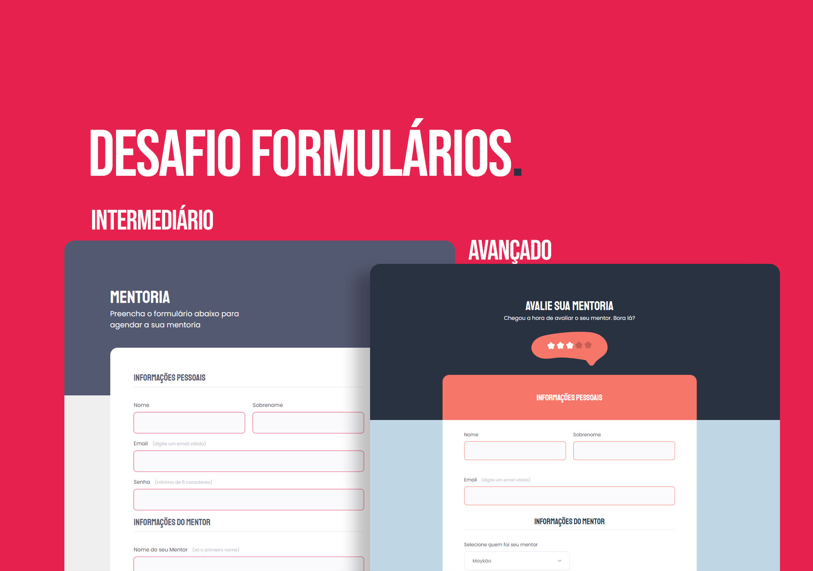

🚀 Tecnologias 

Esse projeto foi desenvolvido com as seguintes tecnologias:

<ul>
<li>HTML e CSS</li>
<li>Git e Github</li>
<li>Figma</li>
</ul>

💻 Projeto

O projeto faz parte do Desafio de Formulários Intermediário e Avançado.

<a href="https://diegoscavone.github.io/Desafio-Fase03-Formulario-Intermediario/" target="_blank">Desafio Intermediário</a>

<a href="https://diegoscavone.github.io/Desafio-Fase03-Formulario-Avancado/" target="_blank">Desafio Avançado</a>

📝 Licença

Esse projeto está sob a licença MIT.

Esse projeto faz parte do Curso Explorer desenvolvido pela Rocketseat.

